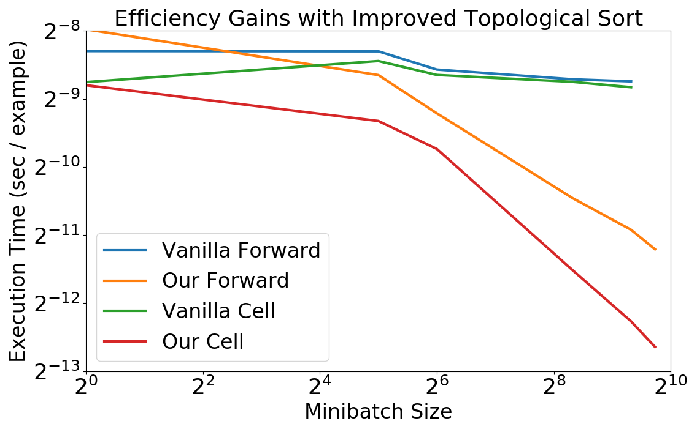
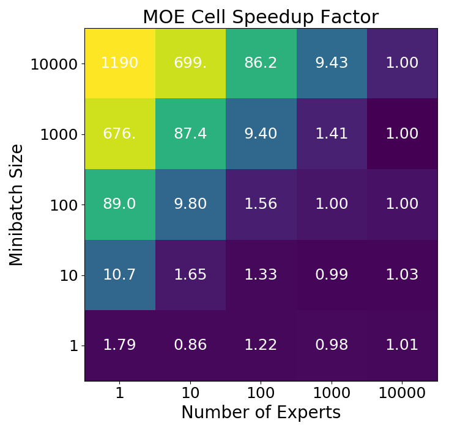
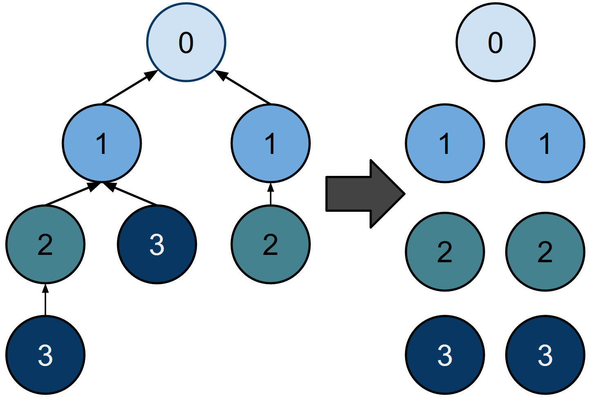

Code from our [paper](https://arxiv.org/abs/1707.02402) Effective Approaches to Batch Parallelization for Dynamic Neural Network Architectures.

Our approach parallelizes execution of reused neural cells, as in Johnson et al.'s [Inferring and Executing Programs for Visual Reasoning](https://arxiv.org/abs/1707.02402) and [Mixture of Experts](https://arxiv.org/abs/1701.06538). We achieve over 10x and 1000x improved cell execution speed in these models, respectively. This approach is quite general and does not rely on graph precompilation as in Tensorflow or lazy execution as in Dynet. All code is written using Pytorch.

Though it was discovered independently, our approach is halfway between Tensorflow Fold's and Dynet's batching systems. As in Dynet, we mark all nodes in the computation graph by their dependency depth and parallelize over reused nodes. As in Tensorflow Fold, we execute all marked groups of parallel nodes at once. We do not reevaluate the set of parallel nodes after executing a single parallel operation. Variants of this approach are valid when the architecture is not known ahead of time. Complexity bounds for all of these are provided in our paper.

If you are interested in experimenting with dynamic batching speedups:
 - The MOE file can be used to reproduce our Mixture of Experts experiments
 - The Net file can be used to train Johnson et. al's IEP CLEVR model. Note the difference between cell time and forward pass time. See our paper for details.
 - This readme will be updated and cleaned shortly within a few days of arxiv publication (7/11). In the meanwhile, the code is quite clean and should not require additional documentation. However, we welcome edits/suggestions.
